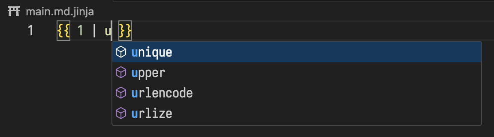
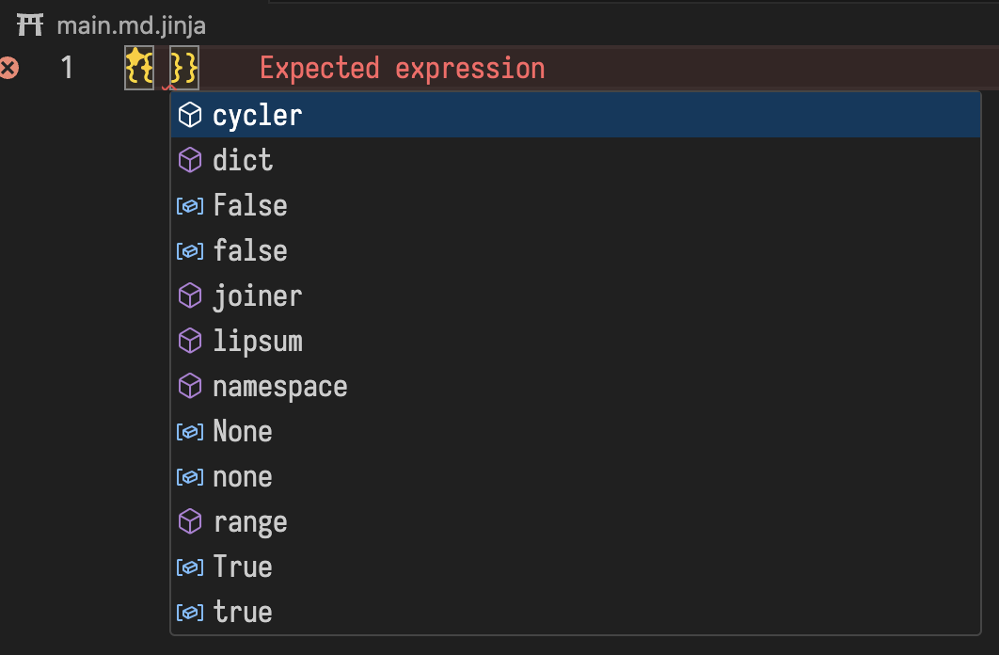
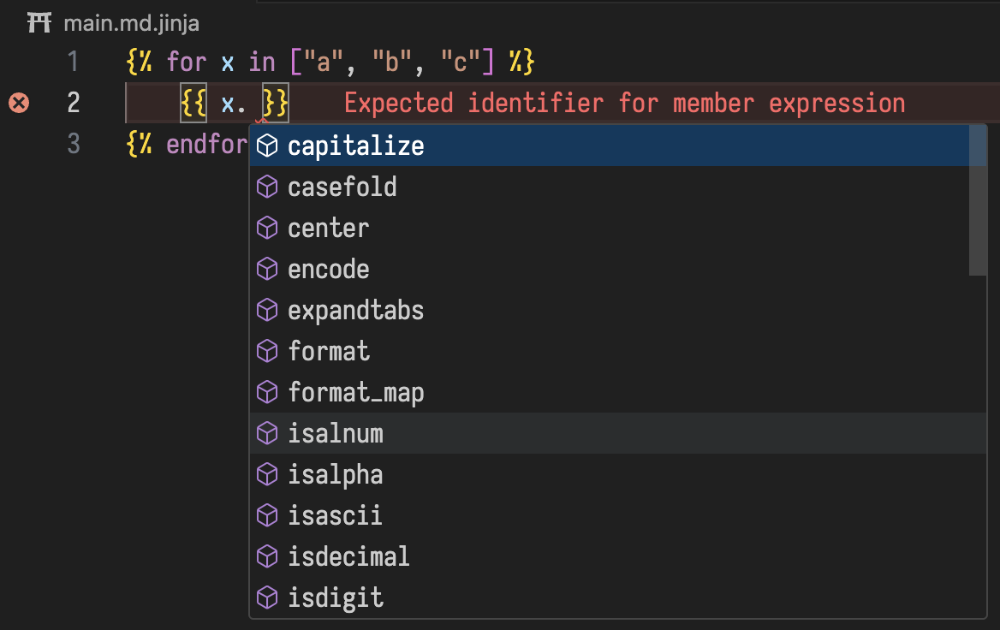
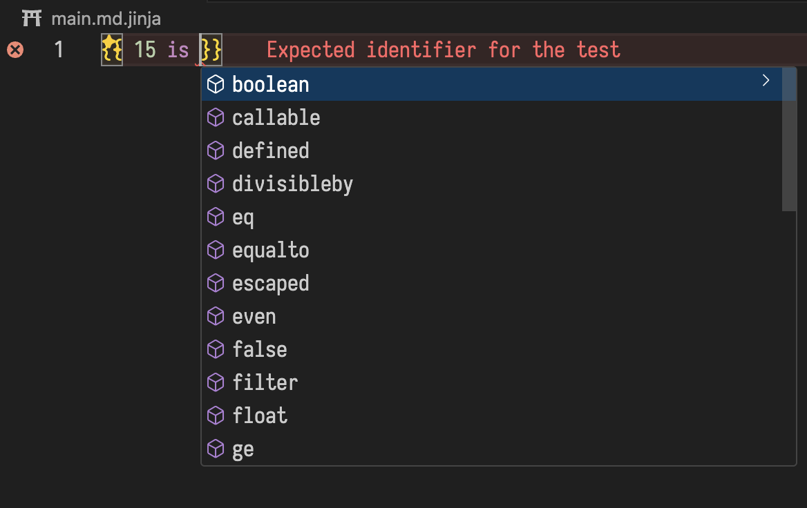
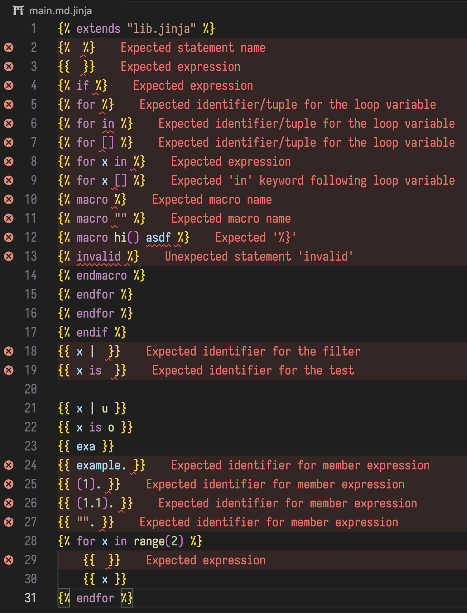
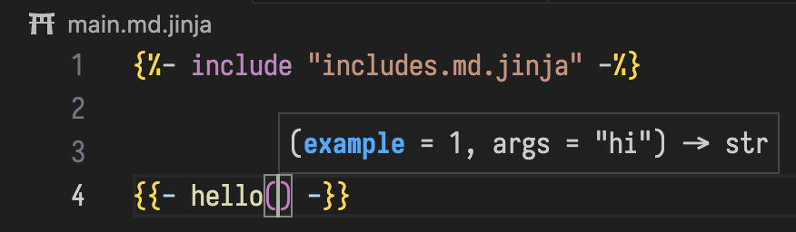
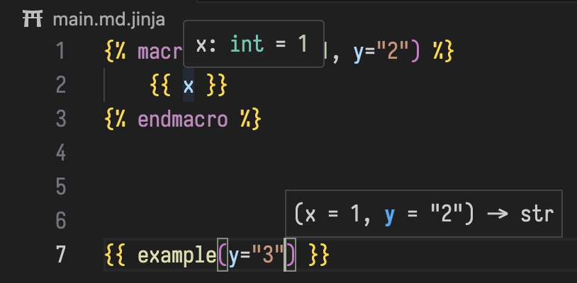

<h1 align="center">
    Jinja Language Server
    <br />
    
    
    
    
    <br />
</h1>

<p align="center">
    <b>Feature-rich language server for Jinja.</b>
</p>

Jinja Language Server is in early development, please report bugs on GitHub!

## Features

- [x] Provide diagnostics for lexing and parsing errors
- [x] Provide semantic highlighting
- [x] Make lexer and parser error tolerant
- [x] Provide hover for variables and macros
- [x] Provide go to definition for blocks, macros and variables
- [x] Provide signature help for macros and globals
- [x] Resolve imports
- [x] Provide symbols from imports
- [x] Track types of expressions including globals and special symbols
- [x] Provide auto-complete for built-in tests and filters and variables
- [x] Provide an API for other extensions to add globals
- [x] Support custom import directories
- [x] Provide documentation for user-defined symbols
- [ ] Provide format document
- [ ] Provide document symbols
- [ ] Support embedded code languages in Markdown (hover, signature help, semantic highlighting, diagnostics)
- [ ] Make lexer/parser more performant (incremental)
- [ ] Support custom start/end symbols (instead of `{{, {%, {#`)
- [ ] Rewrite in rust

## Demo

Errors are shown using the awesome [Error Lens](https://marketplace.visualstudio.com/items?itemName=usernamehw.errorlens) extension!









## Usage

### Configuration

- In VSCode settings you may add directorie paths to "Jinjs LS: Import Paths" to be searched in include/import/from import/extends statements.
- You can also define extra tests, filters and globals that are available in your environment.
- The "Jinja LS: Extra File Extensions" option can be used to show path completion for additional file extensions.

### Documentation

You can document your custom macros and variables like so:

```jinja
{# Shows a solution for multiplying x by y. #}
{# @param {int} x: the first number #}
{# @param {int} y: the second number #}

I can solve {{ x }} * {{ y }} - it's clearly {{ x * y }}!


{#- a magical string! -#}

```

### LS Commands

You can specify LS commands using Jinja comments, for example:

```jinja
{#- jinja-ls: globals ./globals.json -#}
```

adds globals from the `./globals.json` file (relative to the document) to the given document!

This also supports **rich globals** from JSON Schema files (which can be generated from Pydantic for example)
as well as HTTP and HTTPS URLs, for example:

```jinja
{#- jinja-ls: globals https://raw.githubusercontent.com/rendercv/rendercv/refs/heads/main/schema.json -#}
```

### Custom Globals

You can add globals from your extension with the `jinjaLS.addGlobals` command, for example:

```ts
vscode.commands.executeCommand("jinjaLS.setGlobals", {
  hi: "hello",
  other: 1574,
  test: 1.2,
  deep: { object: [1, 2] },
})
```

This merges the existing globals set by previous calls to `jinjaLS.addGlobals`, if you wish to remove them set the third parameter `merge` to false:

```ts
vscode.commands.executeCommand(
  "jinjaLS.setGlobals",
  {
    hi: "hello",
  },
  undefined,
  false,
)
```

You may also specify a URI string for the globals with the second argument so the globals are only defined for that document.

## Acknowledgements

- The [language](./packages/language/) package is based on [@huggingface/jinja](https://github.com/huggingface/huggingface.js/tree/main/packages/jinja), licensed under MIT by Hugging Face.
- The client is heavily based on [jinjahtml-vscode](https://github.com/samuelcolvin/jinjahtml-vscode), licensed under MIT by Samuel Colvin and other Contributors. In particular, the awesome syntaxes and the language configuration are included with only a few modifications!
- The overall layout as well as many code samples are taken from Microsoft's [lsp-sample](https://github.com/microsoft/vscode-extension-samples/tree/main/lsp-sample) licensed under MIT.
- Some of the Jinja documentation is also provided (licensed under MIT), and some of the Python documentation as well (licensed under zero-clause BSD)
- Special thank you to Omri for the original idea.
